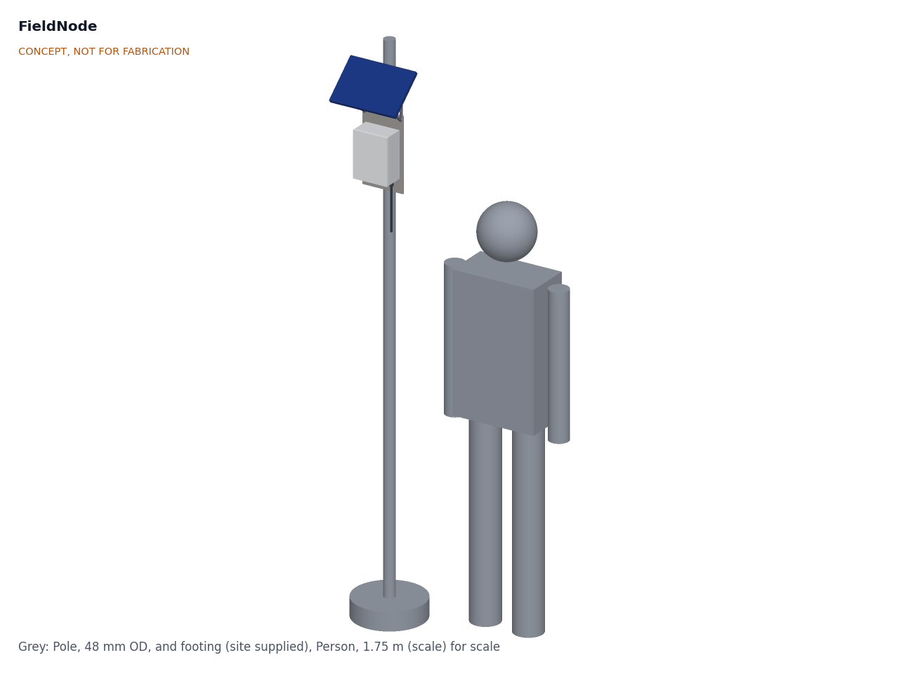
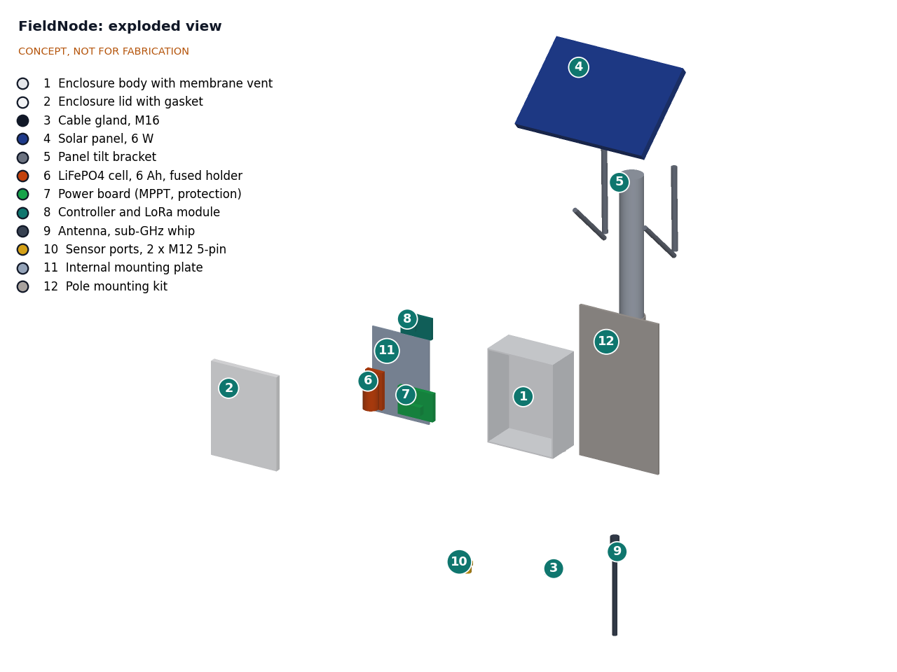
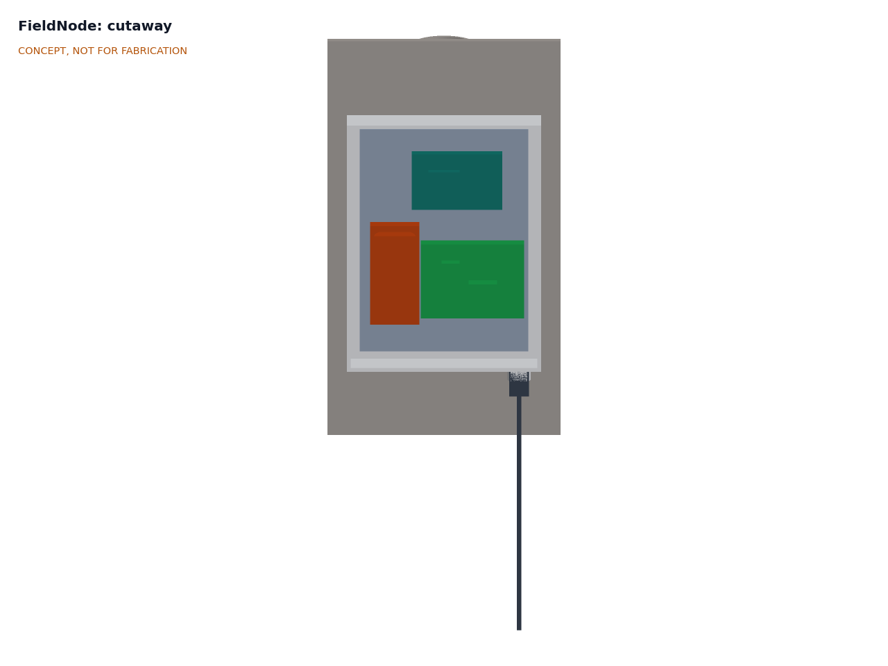
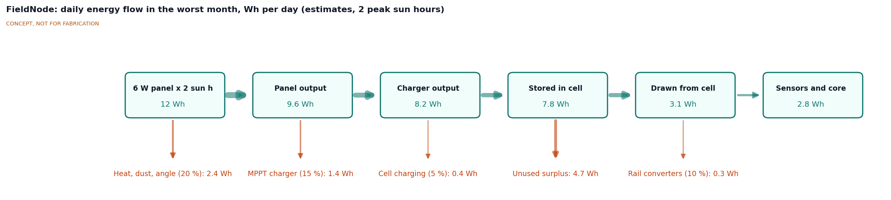

# FieldNode design precis

## Summary

FieldNode is a pole- or wall-mounted outdoor node built from a stock IP65 enclosure, a 6 W solar panel that doubles as a sun and rain hood, a single 6 Ah LiFePO4 cell, an MPPT charge and power board, and an STM32WL-class LoRaWAN module. Two sealed sensor ports carry power and data to whatever the host project measures. On first-order estimates it stays energy neutral in a 2-sun-hour month, rides through about 5 sunless days while giving sensors about 115 mW on average, and costs about $126 in parts. Every choice below is proposed, awaiting Amish.

Figure 1. Concept massing model on a 48 mm pole, with a 1.75 m person for scale. CONCEPT, NOT FOR FABRICATION.

## How it works

1. **Harvest.** The 6 W panel sits above the enclosure at a site-dependent tilt (40° shown), facing the equator. It shades the box from direct sun and sheds rain from the lid seam.
2. **Charge and protect.** An MPPT-style charger on the power board holds the panel near its maximum power point and charges one LiFePO4 cell to 3.6 V. An NTC on the cell blocks charging below 0 °C and above 45 °C, since LiFePO4 cells are typically rated to charge only between 0 and 45 °C ([example cell specification](https://www.batteryspace.com/prod-specs/9055.pdf)). A protection IC and an inline fuse guard against over-discharge and short circuit.
3. **Power the sensors.** The board provides switched 3.3 V, 5 V and 12 V rails to the two sensor ports, so sensors draw nothing while the node sleeps.
4. **Measure and send.** The controller wakes on a timer, powers the sensor, reads it, stores the reading in SPI flash and sends a short LoRaWAN uplink to a TwinKit gateway, The Things Network or any LoRaWAN server. Readings are kept and resent when the link returns.
5. **Mount.** A back plate with V-blocks and two stainless band clamps fits 40 to 60 mm poles; the same plate screws to a wall.

Figure 2. Exploded view; callout numbers match `bom/bom.csv`.

## Main components

Table 1. Components (numbers match the BOM and Figure 2)

| No. | Component | Concept choice |
| --- | --- | --- |
| 1 | Enclosure body | Light grey polycarbonate, about 200 x 150 x 90 mm, IP65 or better, with an ePTFE membrane vent to stop pumping of moist air |
| 2 | Lid | Supplied with the enclosure; gasketed, captive screws |
| 3 | Cable gland | M16, for a sensor with its own cable |
| 4 | Solar panel | 6 W monocrystalline, about 290 x 200 mm, 6 V class |
| 5 | Panel tilt bracket | Aluminium flat bar posts and struts, tilt adjustable by hole position |
| 6 | Cell | LiFePO4 32700, 3.2 V, 6 Ah, in a holder with inline fuse and NTC |
| 7 | Power board | MPPT charger for 1S LiFePO4, protection, fuel gauge, switched 3.3, 5 and 12 V rails |
| 8 | Controller and radio | STM32WL-class module (for example RAK3172 or Wio-E5) on a carrier with SPI flash and status LED |
| 9 | Antenna | Sub-GHz whip on a bulkhead, pointing down below the enclosure |
| 10 | Sensor ports | Two M12 5-pin panel connectors with caps |
| 11 | Internal mounting plate | Carries cell and boards; lifts out as one unit |
| 12 | Pole mounting kit | Back plate, V-blocks, two stainless band clamps; wall screws |

Figure 3. Cutaway from the front: cell (orange), power board (green) and controller (teal) on the internal plate.

## First-order numbers

All values are estimates for review and will be checked at TRL 3.

Figure 4. Daily energy flow in the worst month (estimates).

Table 2. Energy budget, worst month

| Quantity | Estimate | Assumption |
| --- | --- | --- |
| Panel rating times sun | 12 Wh/day | 6 W at 2 peak sun hours on the tilted panel |
| Panel output | 9.6 Wh/day | 20 % loss to heat, dust and angle |
| Charger output | 8.2 Wh/day | 85 % MPPT efficiency at 1S voltages |
| Stored in cell | 7.8 Wh/day | 95 % charge efficiency |
| Drawn from cell at full load | 3.1 Wh/day | Rails 90 % efficient |
| Delivered to sensors and core | 2.8 Wh/day | Core under 0.01 Wh/day, sensors about 2.75 Wh/day |
| Sensor allowance | about 115 mW average | 2.75 Wh over 24 h |
| Surplus | about 4.7 Wh/day | Charger stops when the cell is full |
| Usable cell energy | about 15.4 Wh | 3.2 V x 6 Ah x 80 % |
| Autonomy with no sun | about 5.0 days | 15.4 Wh / 3.1 Wh/day |

**Core consumption.** At SF9 a 20-byte uplink is on air for about 0.25 s. With the SX1262 drawing about 45 mA at +14 dBm and about 4.6 mA in receive ([Semtech datasheet](https://cdn.sparkfun.com/assets/6/b/5/1/4/SX1262_datasheet.pdf)), plus the controller awake for about 0.5 s, each report costs about 16 mA·s. At 96 reports a day that is about 0.43 mAh, plus about 0.8 mAh of sleep and quiescent current (about 33 µA assumed for the whole node). The core therefore uses about 4 mWh a day, which is why nearly all of the energy budget is left for sensors.

**Airtime.** Table 3 gives airtime for a 20-byte payload (33 bytes on air) at 125 kHz. The Things Network allows 30 s of uplink airtime per node per day ([TTN fair use](https://www.thethingsnetwork.org/docs/lorawan/duty-cycle/)).

Table 3. Airtime per day at a 15 min interval (96 uplinks)

| Spreading factor | Time on air per uplink | Per day | Within 30 s? |
| --- | --- | --- | --- |
| SF7 | about 72 ms | about 7 s | Yes |
| SF8 | about 134 ms | about 13 s | Yes |
| SF9 | about 247 ms | about 24 s | Yes |
| SF10 | about 453 ms | about 43 s | No; use 30 min |
| SF12 | about 1.8 s | about 174 s | No; use 3 h or more |

**Link.** At +14 dBm with 2 dBi antennas at both ends and about -129 dBm sensitivity at SF9, the link budget is about 145 dB (estimate). That should reach a gateway a few kilometers away in open or suburban terrain, but range depends on antenna height and clutter and is unverified.

**Wind.** At 35 m/s the dynamic pressure is about 750 Pa. On a 0.058 m² panel with a drag coefficient of about 1.2, the load is about 52 N, a moment of about 16 N·m about the upper clamp (estimates). Two stainless band clamps on a V-block should carry this; slip under repeated gusts is unverified.

**Mass.** About 1.7 kg: enclosure 0.45 kg, panel 0.5 kg, bracket, plate and clamps 0.45 kg, cell 0.14 kg, boards and connectors 0.15 kg (estimates).

**Cost.** About $126 in parts at quantity 1 (see `bom/bom.csv`), within the $150 budget. The gateway is not included.

## Key design choices (all proposed, awaiting Amish)

1. **LoRaWAN rather than Wi-Fi, cellular or LoRa point-to-point.** Kilometer range at milliwatt average power, open network servers, and a match with the TwinKit gateway's LoRa concentrator. Cellular stays a later variant.
2. **STM32WL-class single-chip module.** Radio and controller in one low-sleep-current part, with LoRaWAN stacks that are open source. Alternatives: ESP32 plus SX1262 (easier Wi-Fi setup, far higher sleep current) or nRF52840 plus SX1262 (Bluetooth for setup, two chips).
3. **One LiFePO4 cell rather than Li-ion.** LiFePO4 is less prone to thermal runaway and tolerates heat better, at the cost of lower energy density. A single cell keeps the charger simple and avoids balancing. CellGuard covers 4 to 16 cell packs, so FieldNode would use a 1S protection IC on its own power board rather than CellGuard.
4. **Panel as sun and rain hood.** Shading the enclosure lowers interior temperature and protects the lid seam at no extra part cost.
5. **Antenna pointing down** below the enclosure, out of the panel's shadow and away from hands at the lid.
6. **M12 5-pin sensor ports** rather than bare glands, so sensors can be swapped without opening the box. A gland remains for sensors with fixed cables.
7. **Mounting above head height** (about 1.8 m to the enclosure base) to reduce tampering while staying reachable from a short ladder.
8. **Default 15 min reporting interval**, adjustable from 1 min to 24 h within airtime limits.

## Relationship to other lab projects

- **TwinKit** is the proposed default gateway and data platform; FieldNode sends standard LoRaWAN uplinks, so any LoRaWAN server also works.
- **CalRig** is where sensors should be checked before and after deployment; SensorScope found offsets over 2 °C in pre-deployment checks ([Barrenetxea et al., 2008](https://gsfr.github.io/pdf/sensys2008.pdf)).
- **CellGuard** is not used, because it targets 4 to 16 cell packs; see choice 3.
- Adopting projects named in their READMEs include AirStreet, BridgePulse, CurbCount, FloodGauge, HeatMap Node, LoadZone, NoiseMap, SlopeWatch and WellSense.

## Safety

> **Safety:** The node contains a lithium iron phosphate cell of about 19 Wh. Fuse the cell at the holder, use a protection circuit, and never charge below 0 °C or above 45 °C. Do not install or charge a cell that is swollen, damaged or wet. Store and transport spare cells at partial charge.

> **Safety:** Work at height. Mount from a stable ladder or platform with a second person present, and never on a pole carrying power lines unless the utility authorizes it. Check that the pole and wall anchors can carry the wind load before fitting the panel.

> **Safety:** Glass-fronted panels and cut aluminium bar have sharp edges; deburr all cut parts and wear gloves. Keep the antenna and node clear of overhead conductors.

## Open questions

- [ ] Which two lab projects adopt FieldNode first, and in which region (EU868, US915, AS923 or IN865)? Awaiting Amish.
- [ ] Sensor port pinout: which buses (I2C, UART, RS-485, SDI-12) and which rails are mandatory?
- [ ] Interior temperature in full sun: is the panel hood enough, or is a white radiation shield needed (R3)?
- [ ] Is a 3 W panel variant worth defining for low-power payloads, and a 10 W variant for fan or microphone payloads?
- [ ] Firmware update method in the field: USB through a sealed port, or over the air?
- [ ] Should a cellular variant be defined for sites without a gateway?
