# FieldNode prototype build plan

**Plan, not yet built.** How to build the first proof-of-concept prototype, component by component. Building and testing to it is TRL 4 work. Decisions still to be made are kept in the design decisions register ([docs/06-design-decisions.md](06-design-decisions.md)), not here.

## 1. What you are building

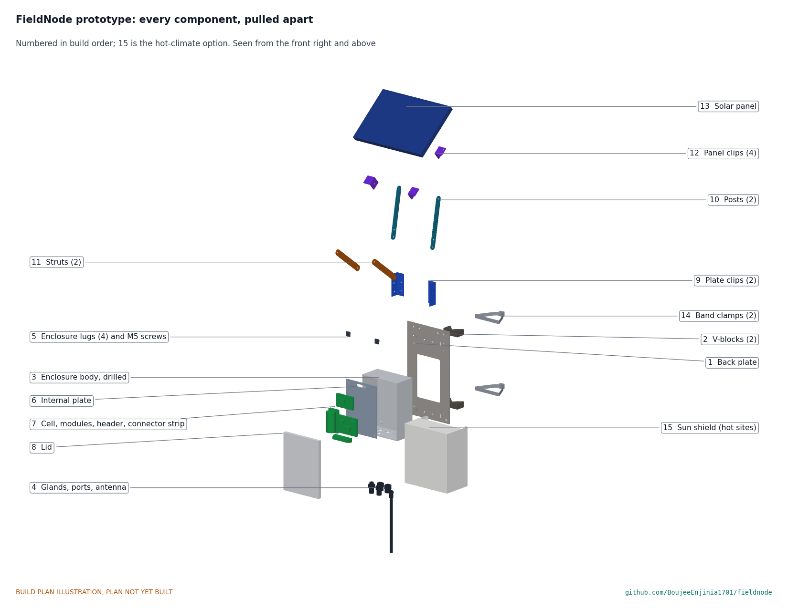

*Figure 1. Every component pulled apart and numbered in build order; 15, the sun shield, is fitted only at hot sites.*

The prototype is one FieldNode on a short length of 48 mm pole: a grey plastic box holding a battery cell and small electronic modules, hung on an aluminium back plate that clamps to the pole, with a solar panel above it on a small bracket that also keeps rain off the box. Figure 1 shows the 15 components in the order you make or fit them. Nine are made in a small workshop: the back plate, two V-blocks, the bracket (two plate clips, two posts, two struts and four panel clips), the printed internal plate and the folded sun shield; the bought box is drilled. Everything else is bought and fitted: the box and lid, cable glands, sensor sockets, vent, antenna, panel, cell, electronic modules and band clamps. The work is sawing, drilling, filing and bending aluminium bar, angle and sheet, drilling a plastic box, one 3D print, and wiring bought modules together with screw terminals. The parts cost about $148 with the shield, from the bill of materials.

> **Safety:** The prototype holds a lithium iron phosphate cell of about 19 Wh and its charger. Keep the fuse out and the cell out of the holder until section 6 says otherwise, never charge it below 0 °C or above 45 °C, and never leave a first build charging unattended. Cut aluminium edges are sharp: deburr everything and wear gloves when handling bar and sheet. Printing ASA gives off fumes; print in a ventilated space.

## 2. What changed to make it buildable

The concept showed what the node does; some of its parts could not be made or fixed as drawn. Each change below keeps what the node does, and all of them are recorded in decision record FND-DDR-003, open for Amish's review.

*Table 1. Changes from the concept.*

| Component | The concept had | The buildable design has | Why |
| --- | --- | --- | --- |
| V-blocks | A block 50 wide, 22 deep and 30 tall with a round seat | A block 60 wide, 33 deep and 20 tall with a true 90° V (Figure 3) | The pole now rests on both faces of the V, not on its edges |
| Holes in the bottom of the box | Six holes in one line; two glands 2 mm apart; the vent overlapping the antenna | Two rows, 27 and 55 mm from the back face, every flange at least 8 mm from the next (Figure 7) | Room for a spanner and the inside nuts; nothing overlaps |
| Box to back plate | No fixing | Four bought lugs at the box's back corners, one M5 screw each (Figure 8) | The box back stays sealed |
| Internal plate | No fixing | Four M4 screws into the box's moulded bosses, 6 mm off the back wall (Figure 11) | Uses what a stock box already has |
| Panel bracket | Flat bars standing on their edges against the plate and panel, with no frame behind the panel end; the panel could swing | Angle clips on the plate and on the panel frame's back lip, with flat bars bolted flat to them; each post held by two bolts (Figures 14, 18 and 19) | Every joint is face to face and bolted, and the frame is a rigid triangle |
| Sun shield | No fixing; it blocked the lid | Folded flanges on the plate and four thumb screws; it slides off to open the lid (Figure 21) | A fixing you can undo by hand at the pole |
| Wiring | No fuses on the sensor supplies; no way to unplug the internal plate | A plug-in connector strip and a resettable fuse on each sensor supply (Figure 12) | A shorted sensor cable cannot drain the cell; the plate lifts out as one unit |
| Back plate | Solid | A 100 x 150 mm window behind the box, and 20 mm (not 25 mm) bar for the bracket | Keeps the node under its 2.5 kg mass limit after the added clips and bolts |

## 3. Making the components

Make and check each component before the assembly step that needs it. Sizes are in millimetres. "Left" and "right" are as seen standing in front of the node, looking at the lid. Workshop tolerance is 0.5 mm unless a step says otherwise; drawings do not carry tolerances before TRL 4.

### 3.1 Back plate

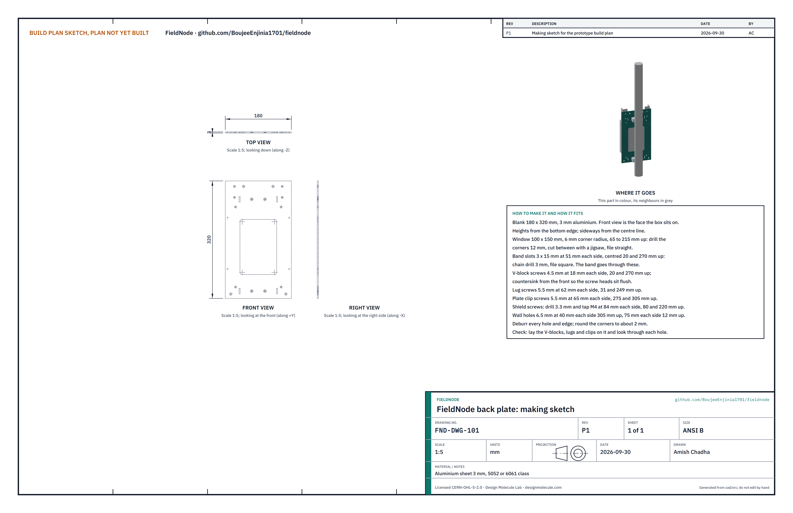

*Figure 2. Back plate making sketch (FND-DWG-101).*

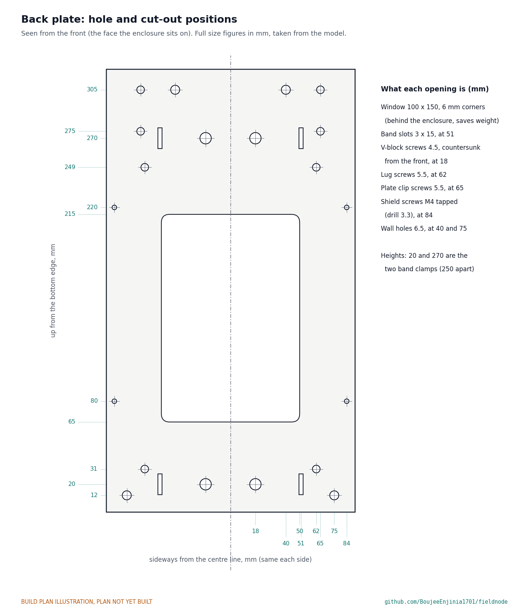

*Figure 2a. Every hole and cut-out, full size figures, measured up from the bottom edge and sideways from the centre line.*

**What it is and what it is made from.** The flat plate that everything hangs on: the box on its front, the V-blocks on its back, the bracket clips at its top. Aluminium sheet 3 mm thick, 5052 or 6061 class, cut to 180 x 320 mm.

**How to make it.**

1. Cut the blank to 180 x 320 mm, square. File the edges and round the corners to about 2 mm.
2. Scribe a centre line down the long side. Choose one face as the front (the box side) and mark it.
3. Mark every hole from Figure 2a: heights up from the bottom edge, sideways from the centre line. Most holes are in pairs, the same distance each side.
4. Band slots: four slots 3 wide and 15 tall, 51 each side of centre, centred 20 and 270 up. Chain drill with a 3 mm drill and file the slots square. The bands go through these.
5. V-block screw holes: four 4.5 mm holes, 18 each side of centre, 20 and 270 up. Countersink them from the front so M4 countersunk screws sit flush.
6. Lug holes: four 5.5 mm holes, 62 each side of centre, 31 and 249 up.
7. Plate clip holes: four 5.5 mm holes, 65 each side of centre, 275 and 305 up.
8. Shield screw holes: four holes 84 each side of centre, 80 and 220 up. Drill 3.3 mm and tap M4.
9. Wall holes: 6.5 mm, 40 each side of centre at 305 up, and 75 each side of centre at 12 up (for wall mounting later; drill them now).
10. Window: 100 wide x 150 tall, centred on the centre line, from 65 to 215 up. Drill a 12 mm hole in each corner (these make the 6 mm corner radius), cut between the holes with a jigsaw and a metal blade, and file the edges straight.
11. Deburr every hole on both faces.

**How it fits the parts next to it.** The box's back sits flat on the front face, between 40 and 240 up, held by four lugs (Figure 8). The V-blocks sit flat on the back face (Figure 3). The bracket's plate clips sit flat on the front face at the top, from 258 up to 15 above the top edge (Figure 14). The shield flanges sit flat on the front face either side of the box (Figure 21).

**Check before moving on.** Lay the V-blocks, lugs and plate clips on the plate and look through each hole: the holes must line up without forcing a screw.

### 3.2 V-blocks (make 2)

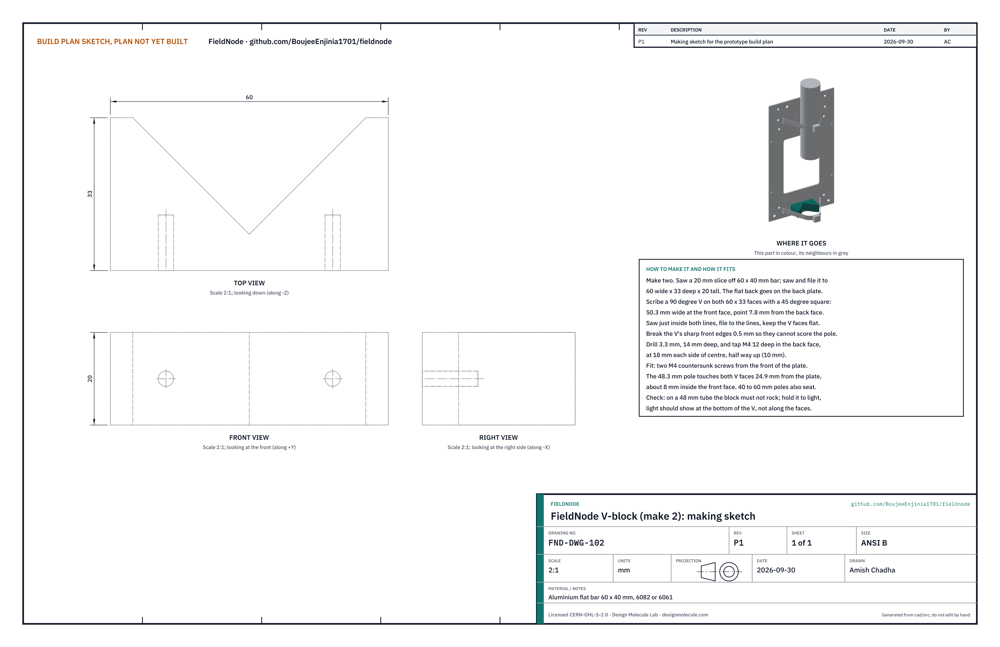

*Figure 3. V-block making sketch (FND-DWG-102).*

**What it is and what it is made from.** A block with a V cut in it that the pole sits in, one at each band clamp. Aluminium flat bar 60 x 40 mm, 6082 or 6061 class.

**How to make it.**

1. Saw two slices 20 mm thick off the bar. Saw and file each to 60 wide, 33 deep and 20 tall. The 60 x 20 face that will sit on the plate is the back face; file it flat.
2. On each 60 x 33 face, scribe the V with a 45° square: two lines from the front face, 50.3 apart where they start, meeting at a point 7.8 from the back face, centred on the width.
3. Saw just inside both lines, then file to the lines. Keep the two V faces flat and square to the block's faces.
4. Break the sharp front edges of the V by 0.5 mm so they cannot scratch a galvanised pole.
5. On the back face, 18 each side of centre and half way up (10 from an edge), drill 3.3 mm 14 deep and tap M4 12 deep.

**How it fits the parts next to it.**

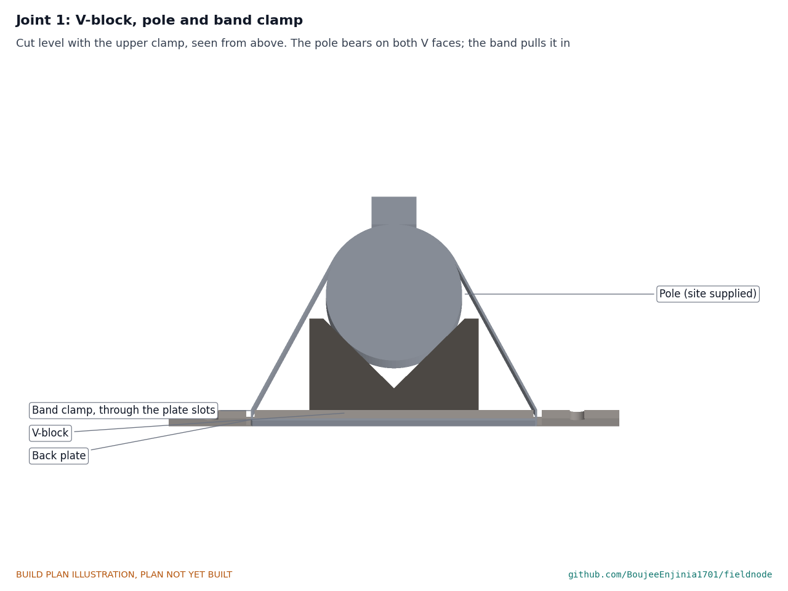

*Figure 4. The pole sits in the V and touches both faces; the band clamp goes round the pole and pulls the pole into the V.*

The back face sits flat on the back of the back plate, held by two M4 countersunk screws put in from the front of the plate with a drop of medium threadlocker. The 48 mm pole touches both faces of the V about 8 mm in from the front face of the block; it never touches the bottom of the V. Poles from 40 to 60 mm also seat on both faces. The band passes 2 mm clear of the block's outer corners.

**Check before moving on.** Hold the block against a 48 mm tube: it must not rock, and you should see light at the bottom of the V but not along its faces.

### 3.3 Enclosure body, drilled, with its glands, ports, vent, antenna and lugs

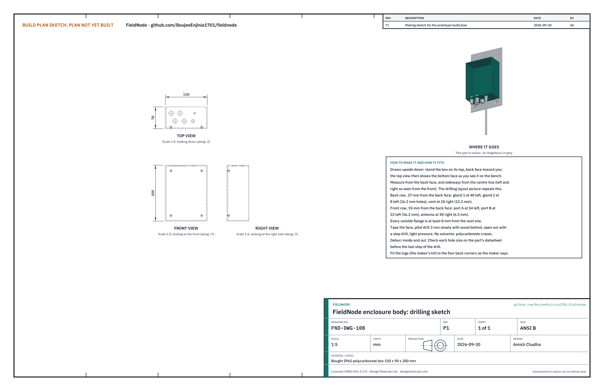

*Figure 5. Enclosure drilling sketch (FND-DWG-108), drawn upside down so the top view shows the bottom face.*

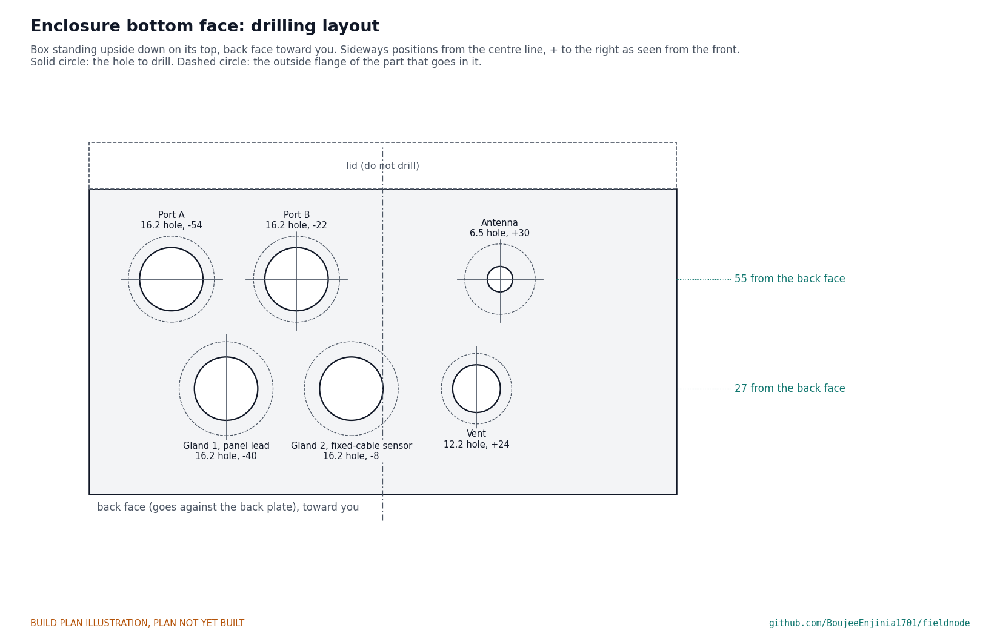

*Figure 6. Drilling layout, with the box standing upside down on its top and its back face toward you.*

**What it is and what it is made from.** A bought grey polycarbonate box, 150 wide, 90 deep and 200 tall, rated IP65, with a gasketed lid on the front, four moulded bosses inside the back wall and the maker's kit of four external mounting lugs. Six holes are drilled in its bottom face.

**How to make it.**

1. Stand the box upside down on its top on a soft cloth, back face toward you. Cover the bottom face with masking tape.
2. Mark the holes from Figure 6. Back row, 27 from the back face: gland 1 (panel lead) 40 left of centre, gland 2 8 left, vent 24 right. Front row, 55 from the back face: port A 54 left, port B 22 left, antenna 30 right. Left and right are as seen from the front of the box.
3. Put a block of wood inside under the face. Pilot drill every hole 3 mm at low speed; do not centre punch hard, since polycarbonate cracks.
4. Open each hole with a step drill, light pressure, low speed: 16.2 for the two glands and two ports, 12.2 for the vent, 6.5 for the antenna. Before the last step, check the size against the part's datasheet.
5. Deburr inside and out, peel the tape, and clean with water and mild soap only; solvents craze polycarbonate.
6. Fit the four lugs to the box's back corners as the lug kit's maker describes.

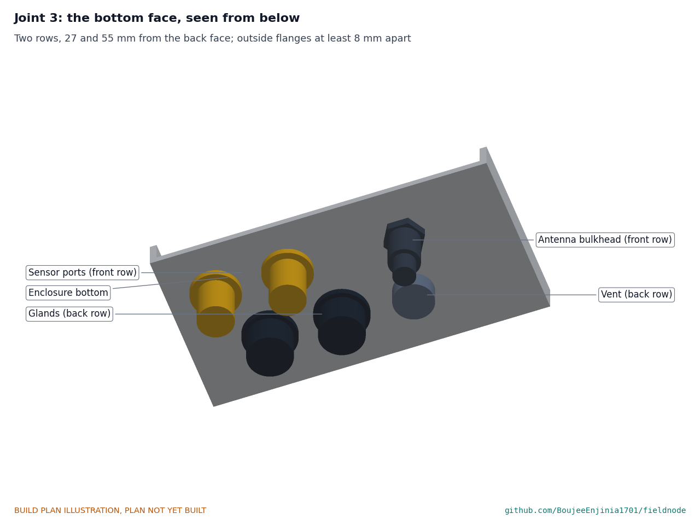

*Figure 7. Glands and vent in the back row, sensor ports and antenna in the front row.*

**How it fits the parts next to it.** Each gland, port, vent and antenna bulkhead goes in from below with its sealing washer outside and its nut inside (step 2). The outside flanges are at least 8 mm apart and the inside nuts about 6 mm apart, so a spanner or deep socket fits. The box's back sits flat on the back plate, held by the lugs:

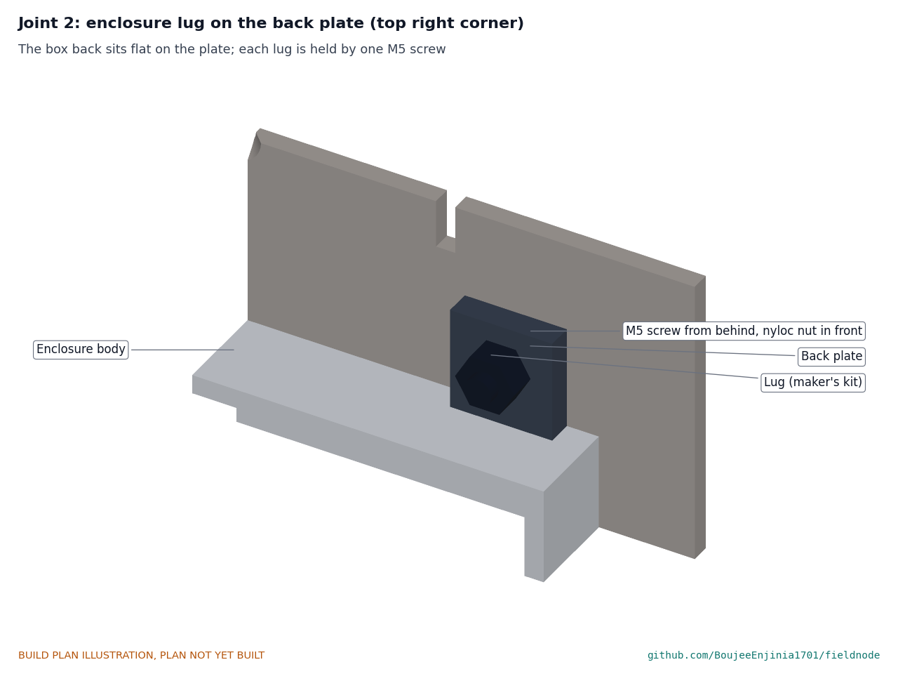

*Figure 8. Each lug lies flat on the plate beside the box and is held by one M5 button-head screw from behind the plate, nyloc nut in front.*

**Check before moving on.** Each part seats flat on its washer; no crack runs out from any hole under a bright lamp; the box sits flat on the back plate with all four lug holes lined up.

### 3.4 Internal plate and the electronics on it

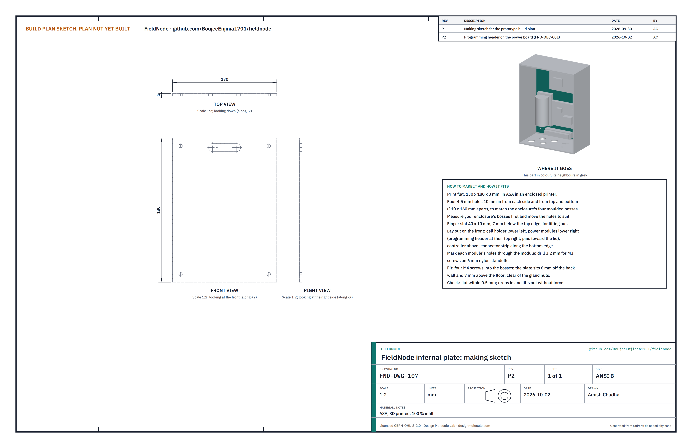

*Figure 9. Internal plate making sketch (FND-DWG-107).*

**What it is and what it is made from.** A printed plate that carries the cell holder, the electronic modules and the connector strip, and lifts out of the box as one unit. ASA plastic, 130 x 180 x 3 mm, printed flat at 100 % infill in an enclosed printer.

**How to make it.**

1. Measure the four bosses inside your box. The model assumes they are 110 apart across and 160 apart up and down; move the plate's holes to match your box.
2. Print the plate with four 4.5 mm holes at the bosses and a 40 x 10 mm finger slot 7 below the top edge. Let it cool on the bed so it does not warp.
3. Lay out the parts on the front face as Figure 10 shows: cell holder lower left, power modules lower right, controller above them, connector strip along the bottom edge.
4. Mark each module's mounting holes through the module, drill 3.2 mm, and fit the modules on M3 screws with 6 mm nylon standoffs. Fit the cell holder with no cell in it and its fuse out.
5. Wire the modules as Figure 12 shows (section 3.4.1).

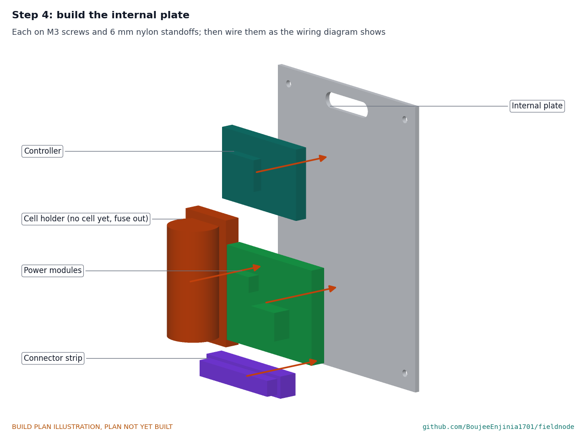

*Figure 10. Where each part goes on the internal plate.*

**How it fits the parts next to it.**

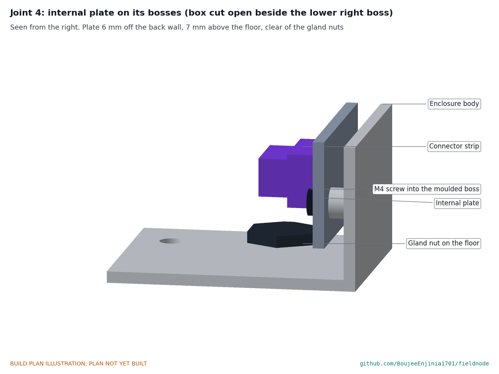

*Figure 11. The plate sits on the four moulded bosses, 6 mm off the back wall and 7 mm above the floor, clear of the gland nuts, held by four M4 screws.*

**Check before moving on.** The plate is flat within 0.5 mm and drops in and lifts out without force.

#### 3.4.1 Wiring

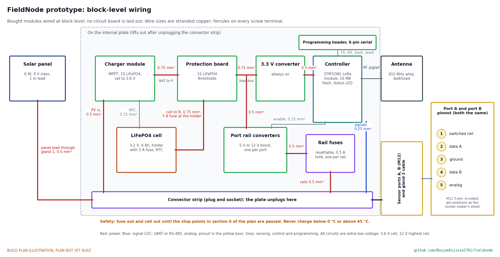

*Figure 12. Block-level wiring with wire sizes. No circuit board is laid out at this stage; bought modules stand in for the power board.*

The power board in the bill of materials is a custom board, which is TRL 4 work. For this prototype, buy modules that meet this specification:

*Table 2. Modules that stand in for the power board.*

| Module | What to buy |
| --- | --- |
| Charger | Single-cell lithium iron phosphate charger with maximum power point tracking (bq24650 or LT3652 class), charge voltage set to 3.6 V, input range covering the 9 V class panel from about 7.4 V when hot up to its open-circuit voltage when cold, and a temperature input that stops charging below 0 °C and above 45 °C |
| Protection board | Single-cell protection board with lithium iron phosphate limits (not lithium-ion limits), rated at 5 A or more |
| 3.3 V converter | Buck-boost converter, always on, feeding the controller |
| Port rail converters | 5 V or 12 V boost converters with an enable input, one per sensor port |
| Rail fuses | Two resettable fuses, about 0.5 A hold, one on each port supply |
| Controller | STM32WL-class LoRa module (RAK3172 or Wio-E5) on its maker's breakout, 16 MB flash breakout, status LED |

Wire it like this, with stranded copper and a ferrule on every screw terminal:

1. Cell holder to the protection board's cell terminals, through the 5 A fuse in the holder lead: 0.75 mm² (18 AWG).
2. Charger battery output to the protection board's pack terminals: 0.75 mm².
3. Protection board pack terminals to the load bus (a small terminal block): 0.75 mm².
4. Load bus to the 3.3 V converter and on to the controller: 0.5 mm² (20 AWG).
5. Load bus to each port rail converter, through its resettable fuse, to the connector strip: 0.5 mm².
6. Controller signal pins to the connector strip: 0.25 mm² (24 AWG). Wire each port to the standard pinout: pin 1 switched rail, pin 2 data A, pin 3 ground, pin 4 data B, pin 5 analog (FND-DEC-001).
7. Controller output pin to each converter's enable input: 0.25 mm².
8. The cell holder's temperature sensor to the charger's temperature input: 0.25 mm², twisted, with the sensor taped to the cell.
9. The panel lead comes in through gland 1 and plugs into the connector strip; the strip then feeds the charger input: 0.5 mm².
10. The radio pigtail runs from the controller to the antenna bulkhead, away from the power wires.

Check that the charger's temperature window really is 0 to 45 °C in its datasheet before buying: some chargers of this class fix a different window.

**Check before moving on.** Every wire continues end to end; with the cell out and the fuse out, the pack terminals and every rail read open to ground; every wire is labelled.

### 3.5 Plate clips (make 2: a left and a right)

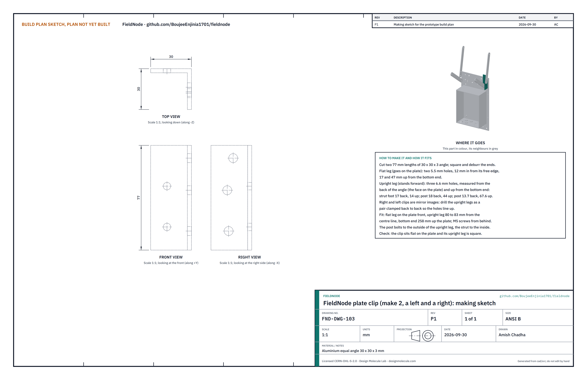

*Figure 13. Plate clip making sketch (FND-DWG-103).*

**What it is and what it is made from.** A short angle bolted to the top of the back plate; its forward leg carries the foot of a post and the foot of a strut. Aluminium equal angle 30 x 30 x 3 mm.

**How to make it.**

1. Cut two 77 mm lengths; square and deburr the ends.
2. Flat leg (the one that goes on the plate): two 5.5 mm holes, 12 in from the leg's free edge, 17 and 47 up from the bottom end.
3. Upright leg (the one that stands forward): three 6.6 mm holes, each measured back from the face of the angle that sits on the plate and up from the bottom end: strut foot 17 back and 14 up; post lower 18 back and 44 up; post upper 13.7 back and 67.6 up.
4. The right and left clips are mirror images. Clamp the two upright legs back to back and drill them together so the holes match.

**How it fits the parts next to it.**

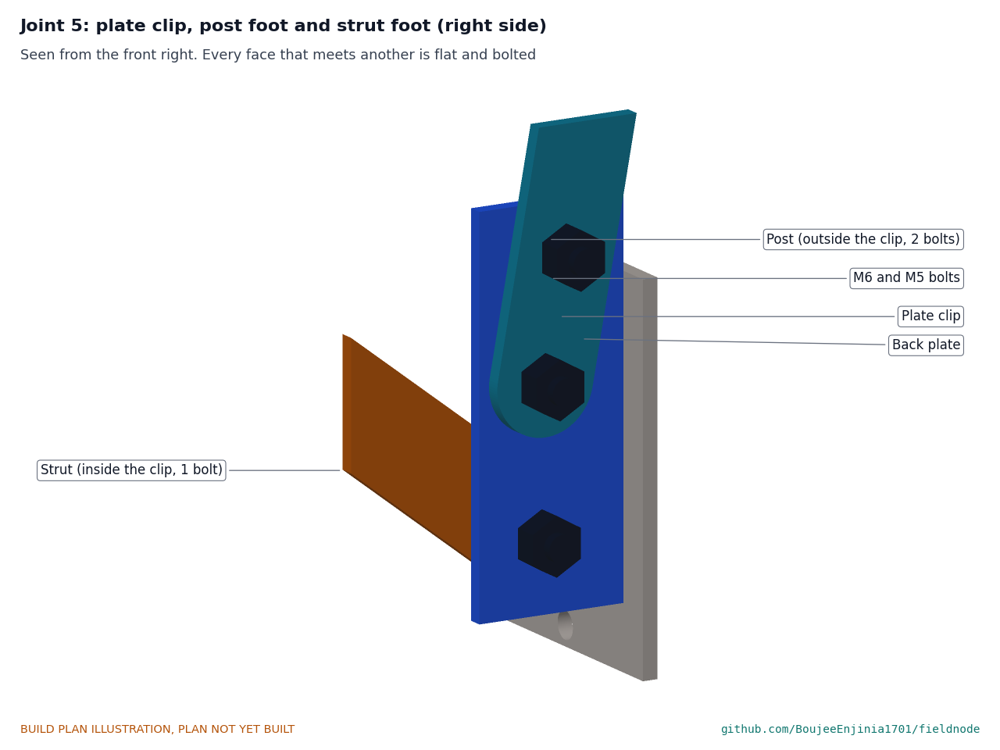

*Figure 14. The post bolts to the outside of the clip's upright leg with two bolts; the strut bolts to the inside with one.*

The flat leg sits flat on the front of the back plate with its bottom end 258 up the plate and its top end 15 above the plate's top edge; the upright leg stands forward 80 to 83 from the centre line. Two M5 button-head screws go through from behind the plate with nyloc nuts in front.

**Check before moving on.** The clip sits flat on the plate and its upright leg is square to it.

### 3.6 Posts (make 2)

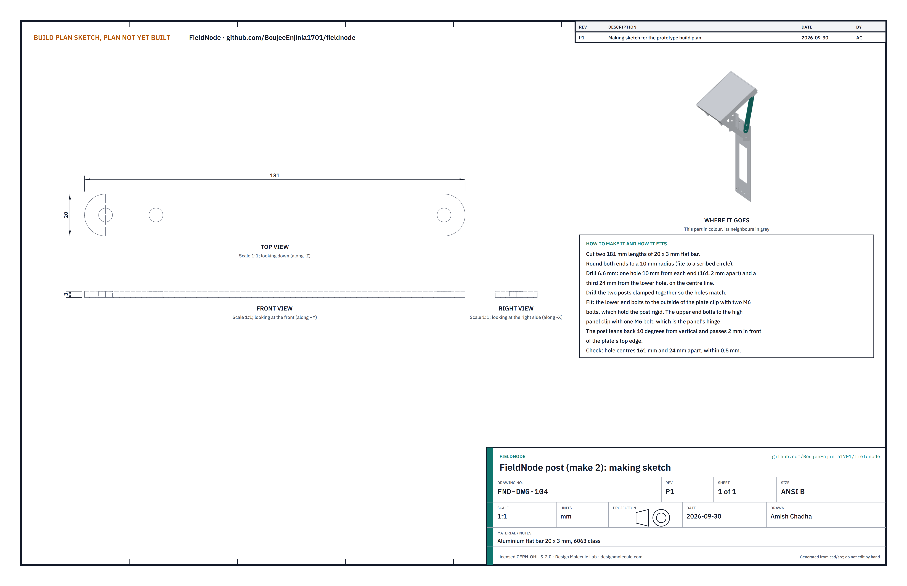

*Figure 15. Post making sketch (FND-DWG-104), drawn laid flat.*

**What it is and what it is made from.** The rear leg of each side of the bracket; the panel hinges on its top. Aluminium flat bar 20 x 3 mm, 6063 class.

**How to make it.**

1. Cut two 181 mm lengths.
2. Round both ends to a 10 mm radius: scribe a circle round each end hole centre and file to it.
3. On the centre line, drill three 6.6 mm holes: 10 from each end (161.2 apart), and one 24 from the lower hole.
4. Drill the two posts clamped together so the holes match.

**How it fits the parts next to it.** The lower end bolts to the outside of the plate clip with two M6 bolts, which hold the post rigid (Figure 14). The post leans back 10° from upright and passes 2 mm in front of the plate's top edge. The upper end bolts to the high panel clip with one M6 bolt, which is the panel's hinge (Figure 18).

**Check before moving on.** Hole centres 161.2 and 24 apart, within 0.5 mm.

### 3.7 Struts (make 2)

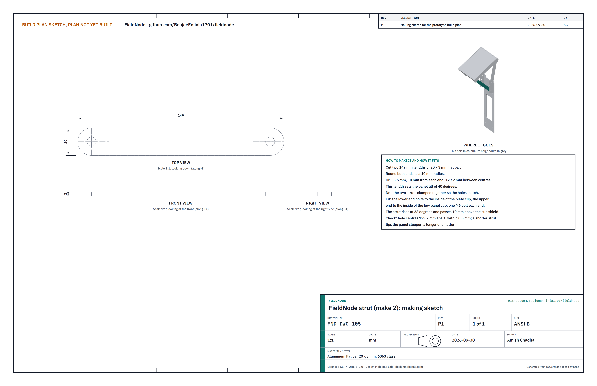

*Figure 16. Strut making sketch (FND-DWG-105), drawn laid flat.*

**What it is and what it is made from.** The front leg of each side of the bracket; its length sets the panel's 40° tilt. Aluminium flat bar 20 x 3 mm, 6063 class.

**How to make it.**

1. Cut two 149 mm lengths and round both ends to a 10 mm radius.
2. Drill a 6.6 mm hole 10 from each end, 129.2 between centres, drilling the two struts clamped together.

**How it fits the parts next to it.** The lower end bolts to the inside of the plate clip (Figure 14) and the upper end to the inside of the low panel clip (Figure 19), one M6 bolt at each end. The strut rises at 38° and passes 10 mm above the sun shield. A shorter strut makes the panel steeper, a longer one flatter.

**Check before moving on.** Hole centres 129.2 apart, within 0.5 mm.

### 3.8 Panel clips (make 4)

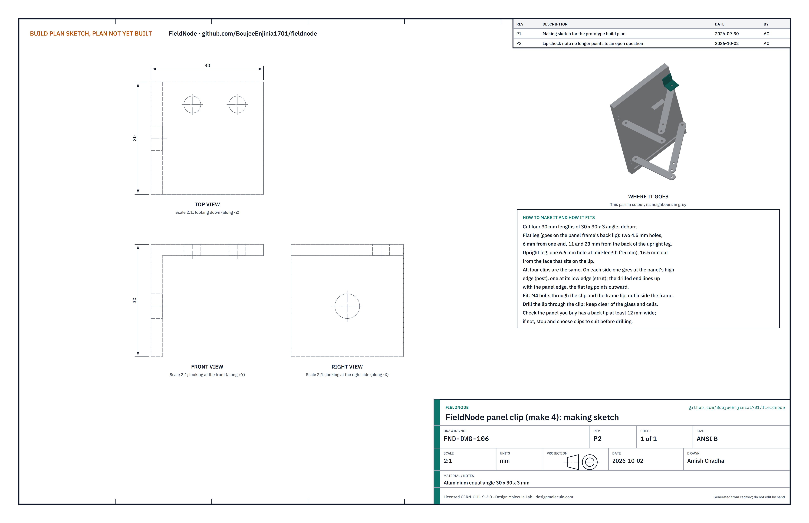

*Figure 17. Panel clip making sketch (FND-DWG-106).*

**What it is and what it is made from.** A short angle bolted to the back of the panel's frame, which gives each post and strut a flat face to bolt to. Aluminium equal angle 30 x 30 x 3 mm.

**How to make it.**

1. Cut four 30 mm lengths and deburr them. All four are the same.
2. Flat leg: two 4.5 mm holes, 6 from one end (the end that will line up with the panel edge), 11 and 23 out from the back of the upright leg.
3. Upright leg: one 6.6 mm hole at mid-length (15 from the end), 16.5 out from the face that sits on the panel frame.

**How it fits the parts next to it.** On each side, one clip sits at the panel's high edge (for the post) and one at its low edge (for the strut), with the drilled end lined up with the panel edge and the flat leg pointing outward, away from the centre. The flat leg sits on the frame's back lip (the flat rim on the back of the panel frame). Measured from the panel's centre line, the inside face of the upright leg is 86 for the high clips and 80 for the low clips, so the post and the strut each sit against their clip's inside face. Drill the frame lip through the clip's holes, keeping well clear of the glass and cells, and fit two M4 bolts with the nuts inside the frame.

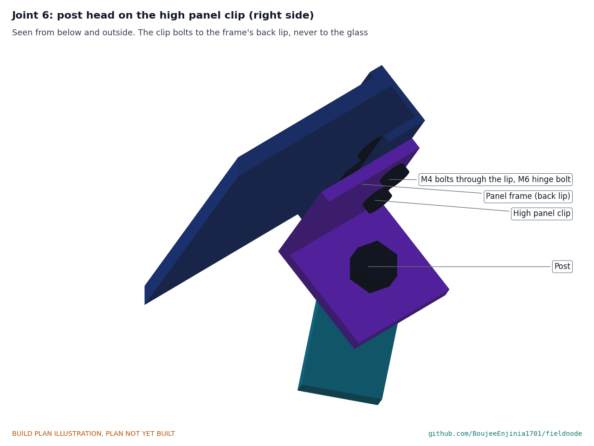

*Figure 18. The post head on the high panel clip, seen from below and outside.*

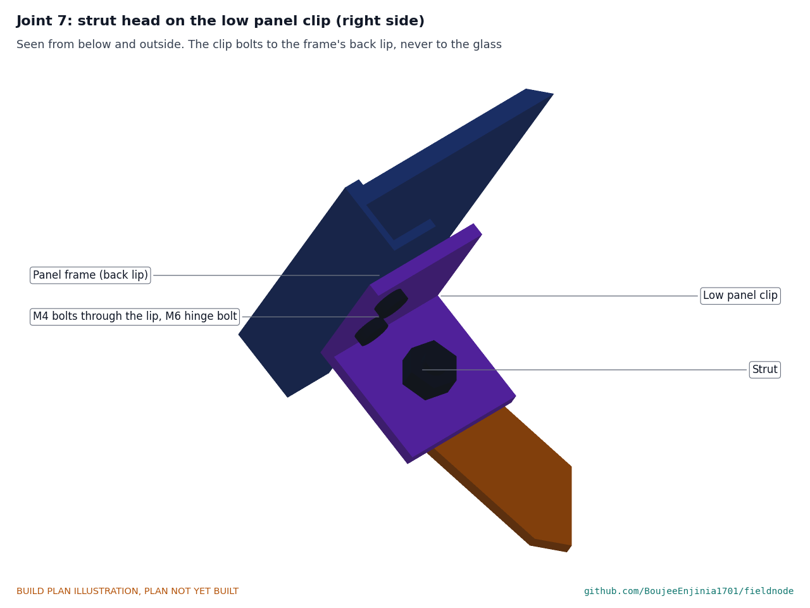

*Figure 19. The strut head on the low panel clip.*

**Check before moving on.** The panel you buy must have a flat back lip at least 12 mm wide; if it does not, stop (section 8).

### 3.9 Sun shield (hot sites only)

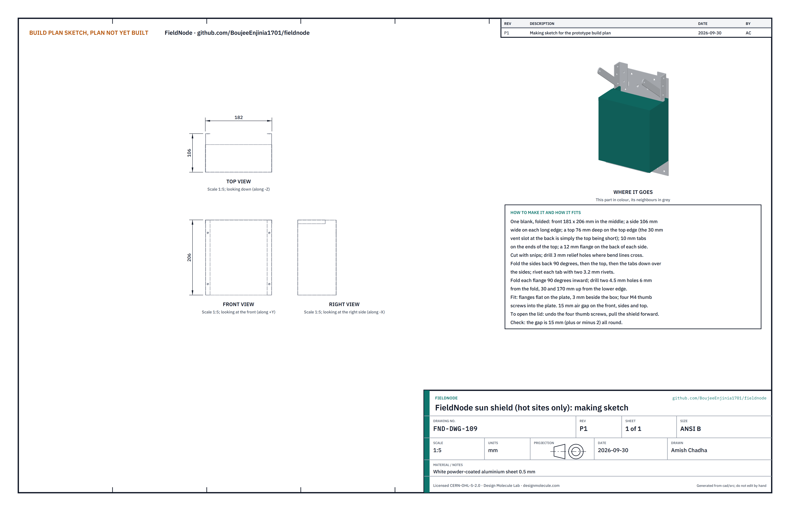

*Figure 20. Sun shield making sketch (FND-DWG-109).*

**What it is and what it is made from.** A white folded sheet that shades the box on its front, sides and top with a 15 mm air gap, fitted only where the site's hottest days pass 30 °C. White powder-coated aluminium sheet 0.5 mm.

**How to make it.**

1. Mark one blank on the protective film: the front, 181 x 206, in the middle; a side 106 wide on each long edge; a top 76 deep on the top edge (the top is short at the back to leave a 30 mm vent slot); a 10 mm tab on each end of the top; and a 12 mm flange along the back edge of each side.
2. Cut with aviation snips. Drill a 3 mm relief hole wherever two fold lines cross, so the coating does not tear.
3. Fold the sides back 90°, then the top back 90°, then the tabs down over the sides. Rivet each tab to its side with two 3.2 mm rivets.
4. Fold each flange 90° inward. Drill two 4.5 mm holes in each flange, 6 from the fold, 30 and 170 up from the lower edge.
5. Peel the film.

**How it fits the parts next to it.**

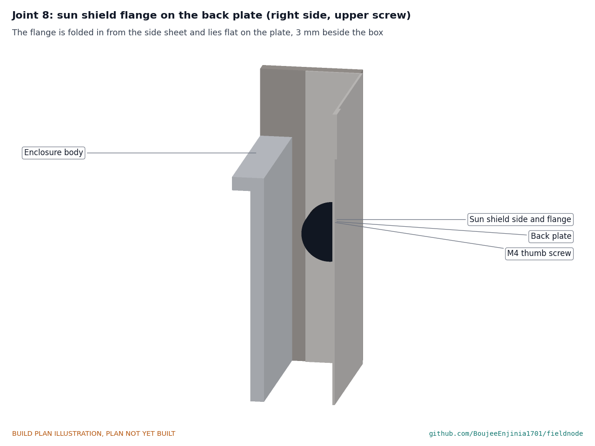

*Figure 21. The flange lies flat on the back plate 3 mm beside the box; an M4 thumb screw holds it.*

The flanges lie flat on the front of the back plate either side of the box, and four M4 knurled thumb screws go through them into the tapped holes in the plate. The shield stands 15 mm off the box's front, sides and top, its lower edge 10 mm above the box's bottom, open at the bottom. The struts pass over it, 10 mm clear. To open the lid, undo the four thumb screws and slide the shield forward; this adds about 2 minutes to a cell swap (about 9 minutes in all).

**Check before moving on.** On a trial fit over the box, the gap is 15 mm, give or take 2, all round.

### 3.10 Bought components

Buy to specification, not brand. Line numbers are those of the bill of materials.

- **Enclosure and lid (lines 1 and 2).** Polycarbonate, IP65 or better, UV stabilised, 150 x 90 x 200 mm outside, lid on the 150 x 200 face, four moulded bosses inside the back wall, and the maker's four-lug wall mounting kit. Drill as section 3.3.
- **Cable glands (line 3).** Two M16 x 1.5 nylon glands, IP68, for 4 to 8 mm cable, and one M16 blanking plug.
- **Solar panel (line 4).** 6 W monocrystalline, 9 V class, about 290 x 200 x 17 mm, aluminium frame with a flat back lip at least 12 mm wide, 1 m lead.
- **Cell and holder (line 6).** 32700 lithium iron phosphate cell, 3.2 V, 6 Ah, from a maker that publishes a datasheet; holder with an inline 5 A fuse, a 10 k temperature sensor and a plug-in lead.
- **Power modules (line 7) and controller (line 8).** As Table 2.
- **Antenna (line 9).** Sub-GHz whip about 190 mm, bulkhead and pigtail, 915 MHz for the US915 first variant, or the band of the first adopting project's site if it is outside North America (FND-DEC-001).
- **Sensor ports (line 10).** Two M12 5-pin A-coded panel sockets, IP67, with caps.
- **Band clamps (line 12).** Two 12 mm stainless worm-drive band clamps, band about 230 to 280 mm round the pole, block and plate.
- **Connector strip and fuses (line 15).** Pluggable terminal strip, 5.08 mm pitch, about 12 ways, plug and header; two resettable fuses of about 0.5 A hold.
- **Fixings (line 13).** Stainless: 10 x M6 x 16 hex bolts with nyloc nuts; 8 x M5 x 12 button-head screws with nyloc nuts; 8 x M4 x 12 pan-head screws with nuts; 4 x M4 x 12 countersunk screws; 4 x M4 x 10 screws; 4 x M4 knurled thumb screws (shield); M3 screws and 6 mm nylon standoffs; wire, ferrules, desiccant pack, cable ties.

## 4. Putting it together

In each picture the parts already fitted are grey and the part being fitted is in colour, with an arrow showing the way it goes in.

### Step 1: V-blocks onto the back plate

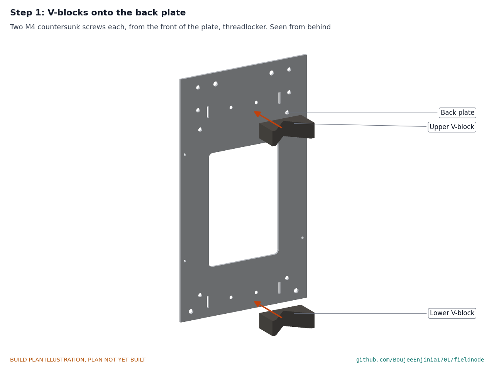

Two M4 countersunk screws per block, from the front of the plate, with medium threadlocker, snug. The V opens away from the plate.

### Step 2: glands, vent, ports and antenna into the box

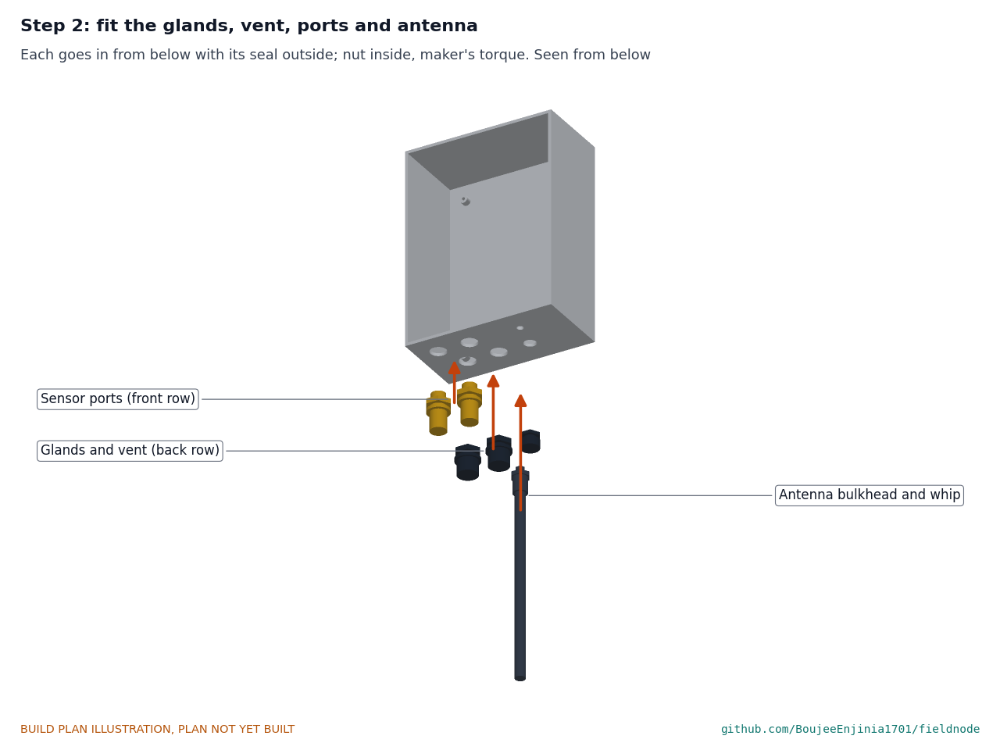

Each goes in from below with its sealing washer outside and its nut inside, tightened to the maker's torque. Put the blanking plug in gland 2 until a sensor cable is fitted.

### Step 3: box onto the back plate

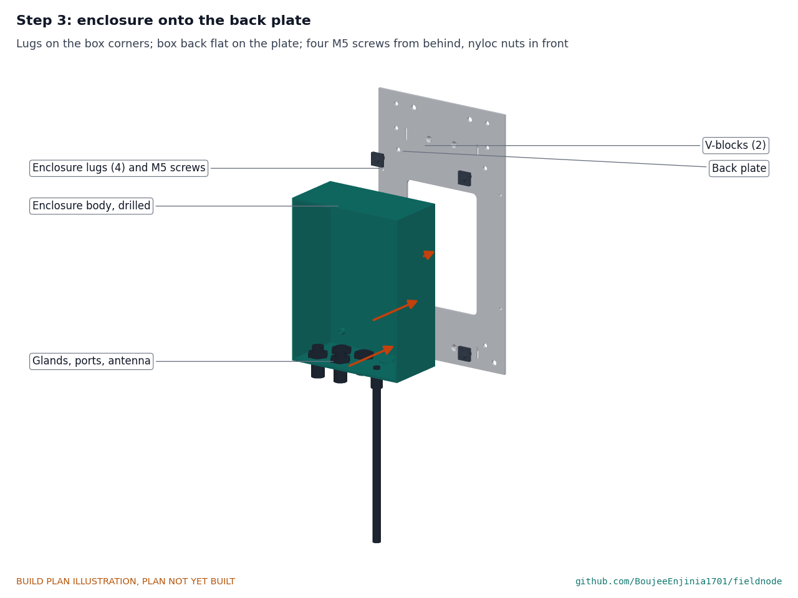

Hold the box flat on the front of the plate, centred, 40 above the plate's bottom edge. Four M5 button-head screws through the lugs from behind the plate, nyloc nuts in front, snug.

### Step 4: build the internal plate

Fit the cell holder (no cell, fuse out), modules and connector strip on M3 screws and standoffs and wire them as Figure 12. **Hold point:** the wiring checks of section 3.4 pass before going on.

### Step 5: internal plate into the box

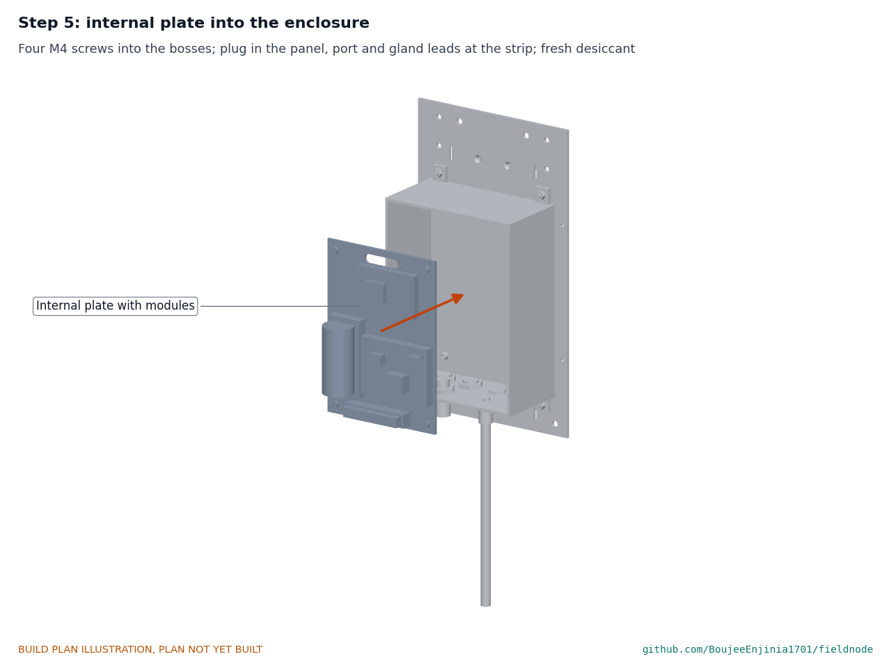

Four M4 screws into the bosses. Plug the panel lead, port leads and gland 2 lead into the connector strip and connect the radio pigtail. Add a fresh desiccant pack. **Hold point:** no wire pinched; the cell and fuse go in only at the stop points of section 6.

### Step 6: close the lid

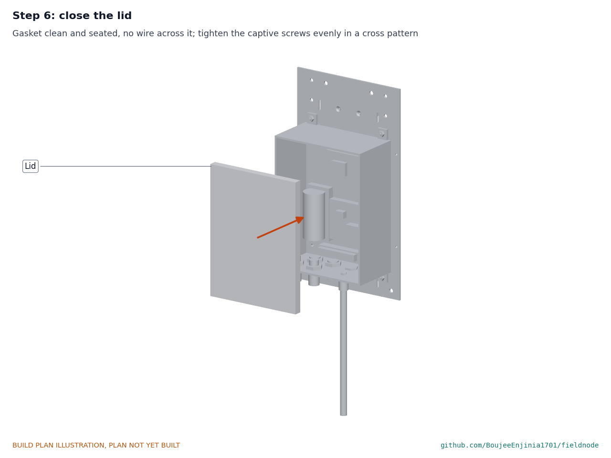

Check the gasket is clean and seated with no wire across it. Tighten the captive lid screws evenly in a cross pattern.

### Step 7: plate clips onto the back plate

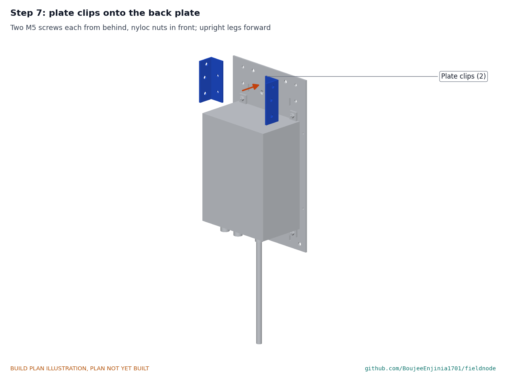

Two M5 button-head screws each from behind the plate, nyloc nuts in front, upright legs standing forward, square to the plate.

### Step 8: posts and struts onto the plate clips

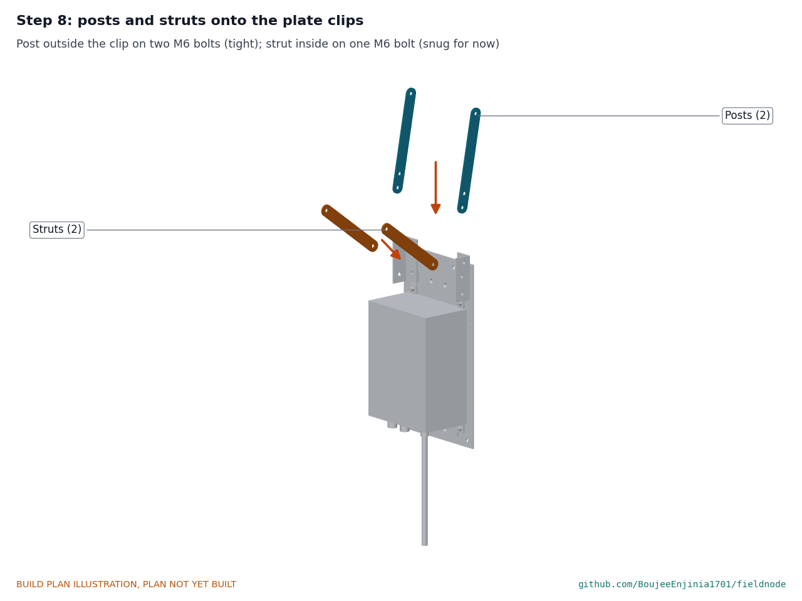

Each post against the outside of its clip on two M6 bolts, tight. Each strut against the inside of its clip on one M6 bolt, snug so it can still swing.

### Step 9: panel clips onto the panel

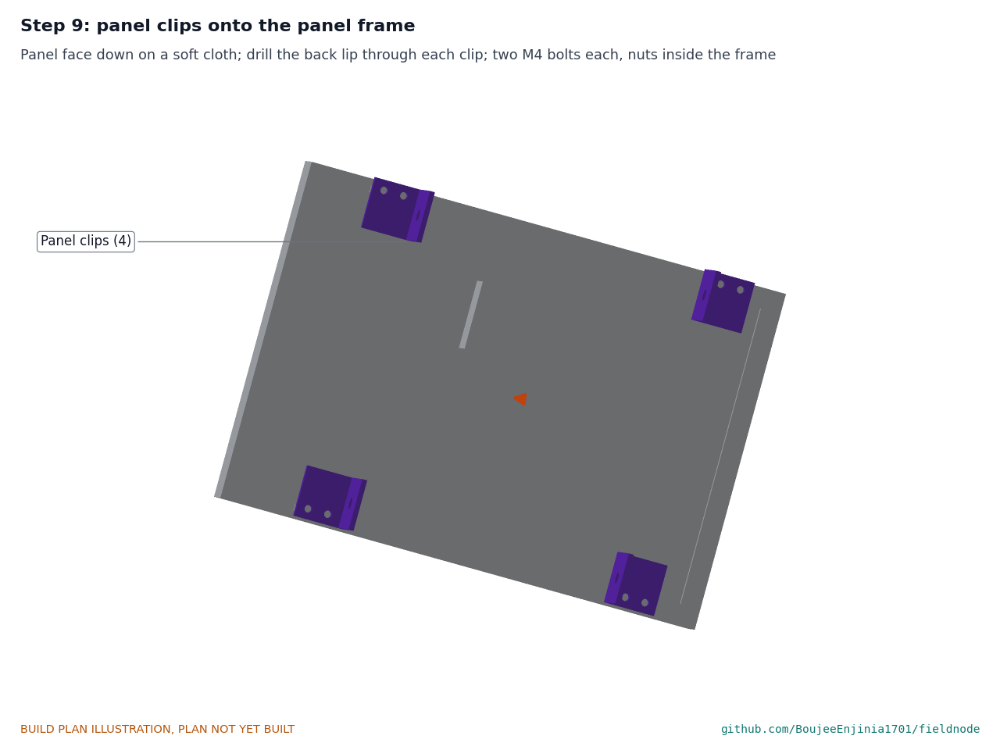

Lay the panel face down on a soft cloth. Place each clip as section 3.8, drill the frame lip through the clip, and fit two M4 bolts with the nuts inside the frame.

### Step 10: panel onto the posts and struts

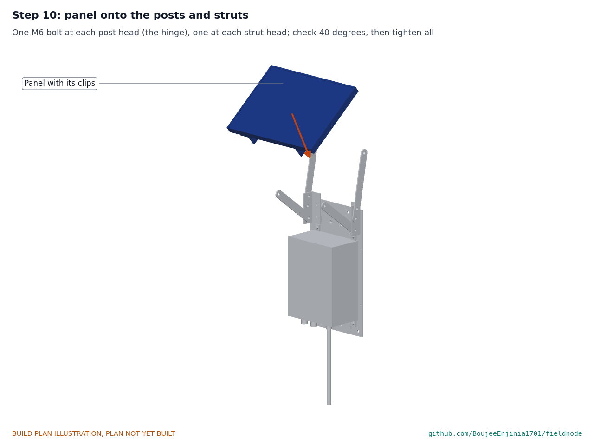

With a helper holding the panel, slide the high clips down over the outside of the post heads (they should go on with light hand pressure; if tight, dress the clip leg with a file) and fit one M6 bolt at each post head. Swing each strut up to its low clip and fit one M6 bolt. Check the tilt is 40° with an angle finder, then tighten every bracket bolt.

### Step 11: sun shield (hot sites only)

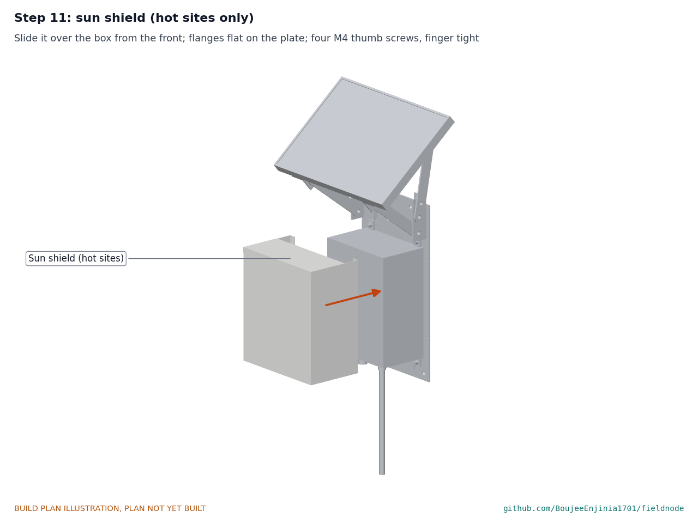

Slide the shield over the box from the front until its flanges lie on the plate, and fit the four thumb screws finger tight.

### Step 12: onto the pole

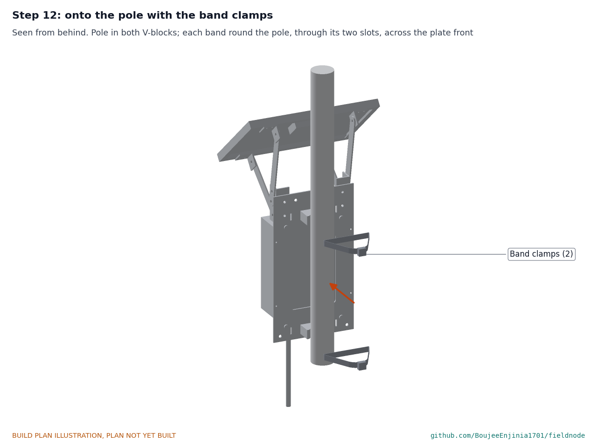

Seen from behind. Hold the node with the pole in both V-blocks. Pass each band round the pole, through its two slots in the plate and across the front of the plate (the lower band below the box, the upper band above it), with the worm-drive housing behind the pole. Tighten both bands to the band maker's torque and record it. **Hold point:** safety stop S7 in section 6.

## 5. First checks

These are the checks a TRL 4 test report would record; this plan only lists them. Requirement numbers are those of FND-REQ-001.

*Table 3. First checks.*

| Check | Requirement | How | Pass when |
| --- | --- | --- | --- |
| Penetrations seated and sealed | R1 | Look at each washer under a lamp; gland caps tight on a 4 to 8 mm test cable | Every washer evenly squeezed; no gaps (the spray test comes later) |
| Charge voltage | R4, R5 | Bench supply at 9 V in place of the panel, current limit 1 A; measure the charger output with the cell out, as its datasheet describes | 3.60 V, give or take 0.05 V |
| Cold and hot charge stop | R4 | Cell fitted; replace the temperature sensor with a resistor equal to its value at -1 °C, then at 46 °C | No charge current in either case (under 10 mA) |
| Normal charge | R4, R5 | Sensor reconnected, cell fitted, bench supply at 9 V, 1 A limit | Current flows; charging ends at 3.6 V |
| Over-discharge cut-off | R4 | Bench supply in place of the cell at 3.2 V, lowered slowly | The protection board cuts the output at its datasheet value |
| Sensor supplies | R7, R11 | Switch each port supply on and off from the controller; measure at the M12 pin | Within 5 % of 5 or 12 V when on; 0 V when off; a short on the pin trips the resettable fuse |
| Internal plate lifts out | R15 | Unplug the connector strip and pigtail, undo four screws | The plate and everything on it comes out in one piece |
| Pole range | R12 | Seat the mount on 40, 48 and 60 mm tubes | Both V-blocks touch the tube on both faces; each band closes with adjustment to spare |
| Band torque | R13 | Torque screwdriver on each band | The maker's torque is reached without the band slipping; value recorded |
| Panel tilt and bracket | R5, R13 | Angle finder on the panel; push on the panel corners by hand | 40° give or take 1°; nothing moves at any joint |
| Mass | R14 | Weigh the node without and with the shield | 2.5 kg or less without the shield (2.45 kg estimated); about 2.61 kg with it |
| Cell swap | R15 | Time a swap with a screwdriver, with and without the shield | 10 minutes or less both ways |

## 6. Safety stops

Stop at each point. Carry on only when everything listed is true.

- **S1. Before the cell comes into the workshop.** Cell voltage about 2.8 to 3.4 V; no swelling, dents or leaks; a datasheet from its maker. Fuse out of the holder. A charging spot ready on a non-combustible surface (ceramic tile or steel tray) with a fire extinguisher for electrical fires within reach.
- **S2. Before the fuse goes in.** With the cell out, the pack terminals and every supply read open to ground. The holder's polarity matches the protection board, checked with a meter, not by wire colour.
- **S3. Before any charging source is connected.** The charge voltage is set and measured at 3.6 V; the panel input polarity is checked at the charger; the charger's maximum input is above the panel's open-circuit voltage at -20 °C.
- **S4. Before the cell is allowed to charge.** Both charge-stop checks of section 5 pass with the substitute resistors. Then the temperature sensor is reconnected and taped to the cell, and the bench supply limit is 1 A or less.
- **S5. First charge.** Attended the whole time, lid open, on the charging spot; cell temperature checked every 15 minutes. Stop if the cell passes 45 °C or 3.65 V. Never bypass the charge stop to gain energy.
- **S6. Before the radio transmits.** The antenna is connected and matches the pilot region's band. Transmitting without an antenna can damage the radio.
- **S7. Before the node goes on the pole stub.** Every bracket bolt tight with nyloc nuts, panel glass whole, sharp edges deburred, both bands through their slots. The stub is clamped to a bench or stand that cannot tip under about 2.6 kg.
- **S8. Before any outdoor installation (outside this plan).** Work from a stable ladder with a second person; never on a pole that carries power lines unless the utility allows it; check the site pole can carry about 81 N of wind load about 2 m up.

## 7. Tools, skills and workspace

**Tools.** Hacksaw with a 24 teeth per inch blade (or a bandsaw); bench vice with soft jaws; bench drill or a drill in a stand; drills 2.5 to 12 mm; step drill to 20 mm; countersink; M4 tap and tap drill; jigsaw with a metal blade; flat and half-round files; deburring tool; scriber, engineer's square, 45° square, steel rule and calipers; digital angle finder; hand sheet folder (or two lengths of hardwood angle clamped in the vice) for 0.5 mm sheet 210 mm long; aviation snips; hand rivet tool; 3D printer with an enclosure and a bed of at least 130 x 180 mm that prints ASA; soldering iron; ferrule crimper and wire strippers; multimeter; bench power supply with an adjustable current limit (0 to 15 V, 0 to 2 A); torque screwdriver covering about 1 to 6 N·m; scale to 5 kg; stopwatch.

**Skills.** No certified trade is needed. Basic metalwork (marking out, sawing, drilling, filing, tapping, folding thin sheet), through-hole soldering and crimping, safe use of a bench power supply and care with lithium cells. All circuits are extra-low voltage: 3.6 V at the cell, 12 V at most on a sensor supply, under about 15 V from the panel. The bench supply must be a certified, undamaged unit; no mains wiring is part of this build.

**Workspace.** A bench about 1.2 x 0.6 m; a metalwork corner kept apart from the electronics so chips stay off the modules; a ventilated place for the printer; the charging spot of S1.

**Personal protective equipment.** Safety glasses for cutting, drilling and soldering; cut-resistant gloves for bar, sheet and the panel; hearing protection when sawing; no gloves near a turning drill.

## 8. Where the numbers come from

- Model and constructability checks: `cad/src/model.py` (`python cad/src/model.py --check`); STEP and STL exports in `cad/step/` and `cad/stl/`.
- Pictures: `cad/src/build_plan_media.py`, using `.kit/build_views.py`; written to `docs/05-build-plan/` and `cad/drawings/FND-DWG-101` to `FND-DWG-109`.
- General arrangement: `cad/drawings/FND-DWG-001.pdf`, Rev P3.
- Calculations: `docs/04-calcs/01-sizing.md` (FND-CAL-001 v0.3) and `docs/04-calcs/sizing.py`; masses [F1], [F1b], cell swap [E2], [E2b], bracket [D5], V-blocks [D6], [D6b].
- Bill of materials: `bom/bom.csv`.
- Decisions: `docs/decisions/0003-design-for-construction.md` (FND-DDR-003), with FND-DDR-001 and FND-DDR-002.
- Requirements: `docs/03-requirements.md` (FND-REQ-001 v0.5).
